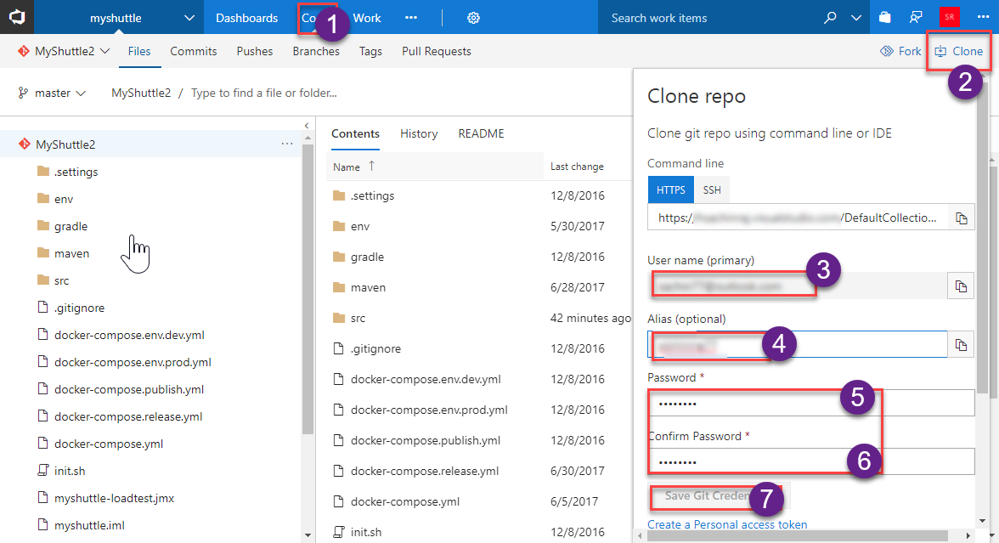

## Working with Jenkins

This lab shows how you can integrate Team Servcies and Jenkins. You can store your code in VSTS and continue to use Jenkins for your continuous integration builds. We will see how you trigger a Jenkins build when you push code to your team project's Git repository or when you check code in to Team Foundation version control

## Pre-requisites
1. Microsoft Azure Account:</b> You will need a valid and active azure account for the labs.

1.  You need a <b>Visual Studio Team Services Account</b> and <a href="http://bit.ly/2gBL4r4">Personal Access Token</a>

1. You will need Putty

## Setting up the project

1. Use <a href="https://vstsdemogenerator.azurewebsites.net" target="_blank">VSTS Demo Data Generator</a> to provision a project on your VSTS account 

 2. Select **MyShuttleJenkins** for the template

## Setting up Jenkins VM
1. Lets set up a Jenkins VM on Azure. We will use the VM image available on Azure MarketPlace

    
    
 
1. Once the machine is provisioned, selct **Connect** and note down the connection string. This should be in a <username>@<ip address> format. We will need this to conenct from Putty
    

1. Open a commannd prompt and type the following command
    > putty.exe -ssh -L 8080:localhost:8080 <username>@<ip address>

    

1. Login with the user name and password that you provided when you provisioned the VM.

1. Once you are connected successfully, 

1. Open a browser and type [http://localhost:8080](http://localhost:8080)

1. Since this is the first time you are connecting to Jenkins, you will need to enter the initial password. Return to the putty terminal password and type the following command 
    >sudo nano /var/lib/jenkins/secrets/initialAdminPassword

1. Press **Ctrl+K** to copy the text and place it in the clipboard. Press **F2** to exit the nano editor

1. Back in the browser, paste the text and select **Continue**

1. You can create a first admin user for Jenkins. Enter a user name and password and select **Continue**

1. Now, you have Jenkins ready to use.

## Installing and configuring Maven

Since Maven plugin is not automatically installed by default starting from Jenkins 2, we will need to do this manually

1. Select **Manage Jenkins** on the main page of the Jenkins portal.  This will take you to the Manage Jenkins page, the central one-stop-shop for all your Jenkins configuration. From this screen, you can configure your Jenkins server, install and upgrade plugins, keep track of system load, manage distributed build servers, and more! 

1. Select **Manage Plugins** 

    

1.  Select **Available** tab and search **maven-plugin** in the filter box

1. Check **Maven Integration Plugin** and selct **Install without restart** to install the plugin

1. Select **Manage Jenkins** and select **Global Tool Configuration**

    

1.  We will need to install and configure Maven first. Jenkins provides great out-of-the-box support for Maven.  We could  manually install Maven by extracting the ***tar*** file located in a shared folder. Alternatively, we can let Jenkins do all the hardwork and download Maven for you. Select the **Install automatically** checkbox. Jenkins will download and install Maven from the Apache website the first time a build job needs it. 

    We will install version 3.5, the latest version at the time the lab is written
    

1. Click **Apply** and select **Back to Dashboard** to return to the home page. 

## Creating a new CI definition

1. From Jenkins home page, select **New Item**. Enter a name for the build definition, and select **Maven project**. Click **OK** to save 
    

 1. Scroll down to the **Source code Management** section. Select **Git** and Enter the clone URL of your VSTS Git repo. It should be in http://<your account name>.visualstudio.com/<your project name>/_git/MyShuttle

    

    VSTS Git repos are private. So you will need to provide the credentials to access the repository. If you have not set the Git crednetials, you can do it from VSTS
    
    
1. 